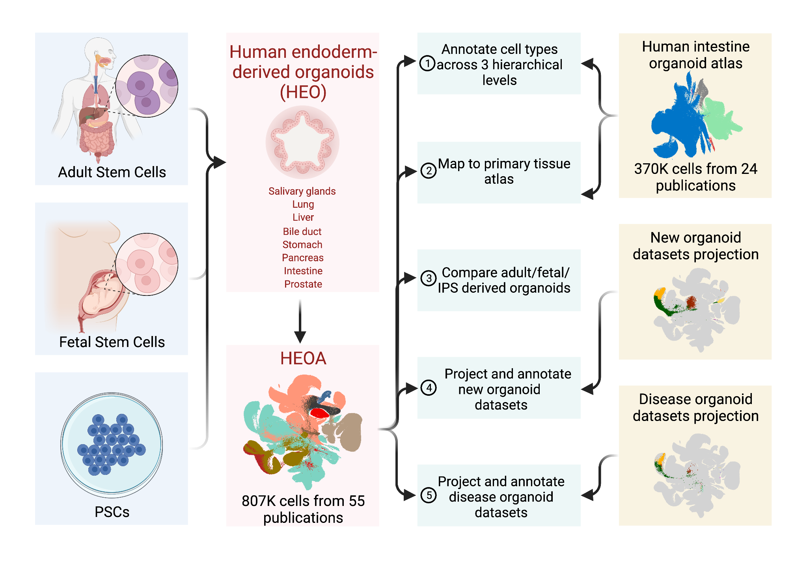

# HEOCA: Human Endoderm-derived Organoids Cell Atlas

## Integrated human cell atlas of endoderm-derived organoids 
Organoids of the endoderm can recapitulate aspects of developing and adult human physiology. Organoids derived from embryonic or induced pluripotent stem cells model development and are guided to specific tissue types via morphogens, whereas organoids derived from tissue-resident fetal or adult stem cells are organ-identity-determined and may model ontogenetic features. However, it has remained difficult to assess the similarity and differences between organoid protocols, and to understand the precision and accuracy of organoid cell states through comparison with primary counterparts. Advances in computational single-cell biology allow the comprehensive integration of datasets with high technical variability. Here, we integrate published single-cell transcriptome datasets from organoids of diverse endoderm-derived tissues including lung, pancreas, intestine, salivary glands, liver, biliary system, stomach, and prostate to establish an initial version of a human endoderm organoid cell atlas (HEOCA). The integration includes nearly one million cells across diverse conditions and data sources. We align and compare cell types and states between organoid models, and harmonize cell type annotations by mapping the atlas to primary tissue counterparts. We focus on intestine and lung, and clarify developmental and adult physiology that can be modeled in vitro. We provide examples of data incorporation from new organoid protocols to expand the atlas, and showcase how comparison to the atlas can illuminate interesting biological features of new datasets. We also show that mapping disease organoid single-cell samples to HEOCA identifies shifts in cell proportion and gene expressions between normal and diseased cells. Taken together, the atlas makes diverse datasets centrally available (https://cellxgene.cziscience.com/), and it will be useful to assess organoid fidelity, characterize perturbed and diseased states, streamline protocol development, and will continuously grow in the future. 

## Cell browser
* [HEOCA-HEOCA](https://cellxgene.cziscience.com/collections/6282a908-f162-44a2-99a3-8a942e4271b2)
* [HEOCA-HIOCA](https://cellxgene.cziscience.com/collections/6282a908-f162-44a2-99a3-8a942e4271b2)
* [HEOCA-HLOCA](https://cellxgene.cziscience.com/collections/6282a908-f162-44a2-99a3-8a942e4271b2)

## Key methods
* [snapspeed (hierarchy cell type annotation)](https://github.com/devsystemslab/snapseed)
* [sc2heoca (query new organoid scRNA-seq data to HEOCA)](https://github.com/devsystemslab/sc2heoca)
* [wilcoxauc (single cell Wilcoxon rank sum test and auROC analysis)](https://github.com/bioqxu/wilcoxauc)

## Analytic reproducibility
* [Code for integration](https://github.com/devsystemslab/HEOCA/tree/main/scripts)
* [Code for plot](https://github.com/devsystemslab/HEOCA/tree/main/notebooks)

## Citation
Q

## Help and support
* The preferred way to get support is through the [Github issues page](https://github.com/devsystemslab/HEOCA/issues).

## License
- **[MIT license](http://opensource.org/licenses/mit-license.php)** 
- Copyright 2023 © <a href="https://github.com/devsystemslab" target="_blank">devsystemslab</a>.

